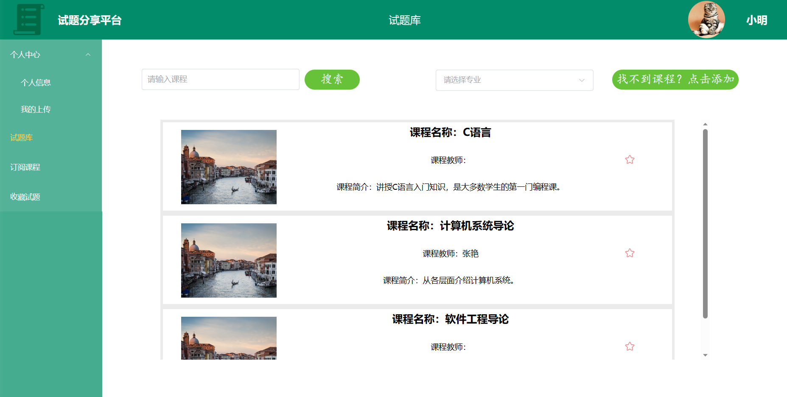
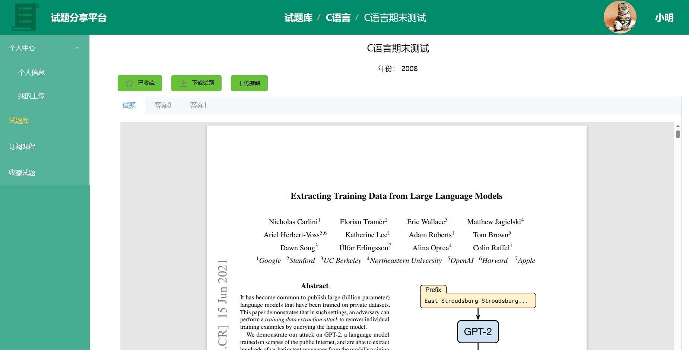
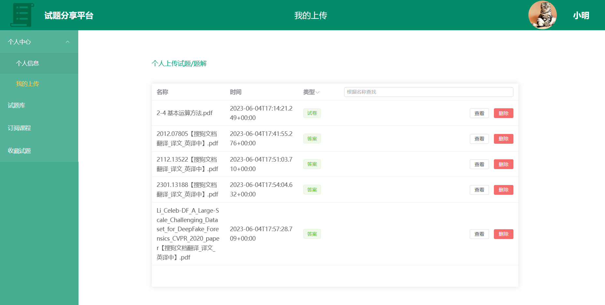

# papershare-frontend
试题分享平台-前端。本项目由刘江浩，刘嘉政，张学博，轩广哲，项黎明编写。

## 项目简介
本项目是试题分享平台的前端部分。该Web应用实现了试题上传、下载、评论、收藏等核心功能，以及课程、试题管理等辅助功能，并支持游客、普通用户、管理员三种角色访问。后端部分为https://github.com/dawnex3/papershare-backend。  
使用的主要技术有：vue, vue-router, element-plus, axios  
主要开发环境为：vue/cli 5.0.8  

## 目录结构
```
papershare
│
├─public            
│
└─src
    │  App.vue        项目入口
    │  main.js        初始化
    │
    ├─assets          资源
    │
    ├─components      组件
    │
    ├─router          路由
    │
    ├─utils           工具函数
    │
    └─views           主要页面

```

## 应用截图
1. 课程页面

2. 试题页面

3. 个人上传页面

